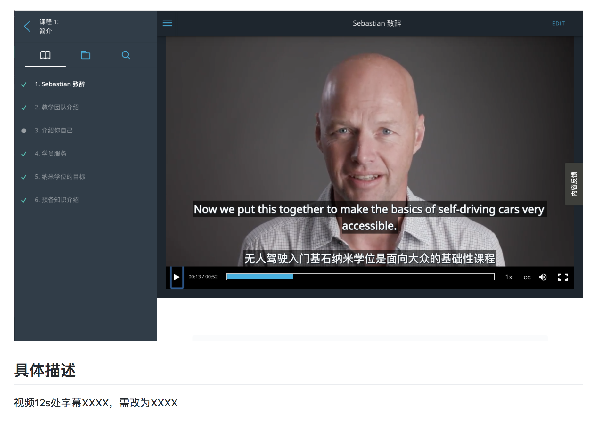

# intro2python_china
# cn-I2P-issue-reports
# 如何提供反馈（Issue）

### 创建Issue

打开仓库链接：https://github.com/udacity/cn-cv-issue-report ，选择 `Issues` 面板新建 `issue` ：

问题描述完毕后点击 `Submit new issue` ，提交。

### 反馈模板

你可以分配给的优达学城工作人员：

> 课程经理：@CheneyZeng
>
> 本地化负责人：@sylviasun916
>

